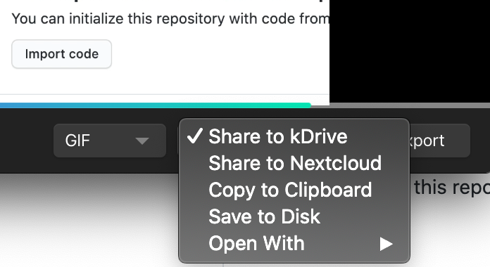

# kap-kdrive

KAP screen recorder plugin to upload files to Infomaniak drive

* When Upload is done share link is copied to clipboard
* Works with Kap 3

## Share



## Development

If you want to debug setup [KAP dev environment](https://github.com/wulkano/Kap/blob/master/contributing.md) and run:

```
export ELECTRON_ENABLE_LOGGING=1
```

In your plugins directory run ([details](https://github.com/wulkano/kap/blob/master/docs/plugins.md)):

```
npm link
```

Link your package to existing KAP plugins directory

```
cd ~/Library/Application\ Support/Kap/plugins
npm link kap-kdrive
cd /Applications/Kap.app/Contents/MacOS
./Kap
```

Make sure you raise the version number to make sure it does not get overwritten by the regular install process.
